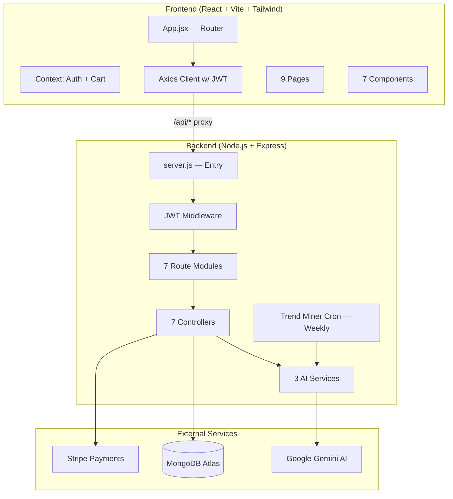
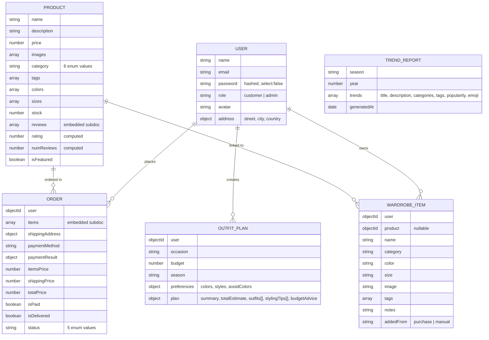
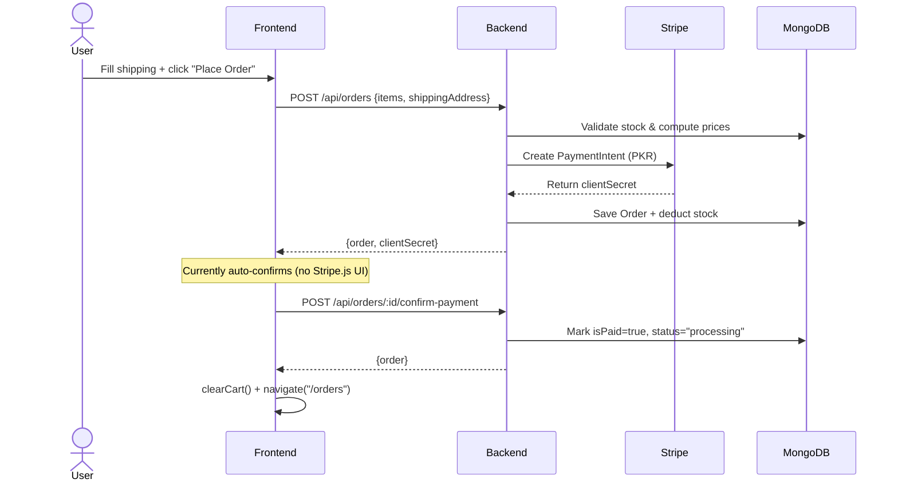
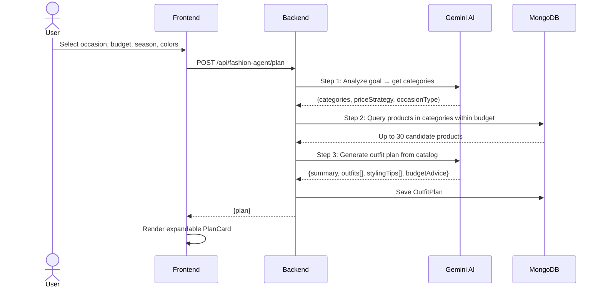

# Grace in Abaya — Complete Project Analysis

**Project Type:** AI-Powered Modest Fashion E-Commerce Platform (MERN Stack)  
**Academic Context:** Final Year Project (FYP) — BS Computer Science, UET Peshawar  
**Currency:** PKR (Pakistani Rupee)

---

## High-Level Architecture



---

## Backend Deep Dive

### Tech Stack
| Technology | Version | Purpose |
|---|---|---|
| Node.js + Express | ^4.18.2 | REST API server |
| MongoDB + Mongoose | ^8.0.3 | Document database |
| JWT (jsonwebtoken) | ^9.0.2 | Authentication tokens |
| bcryptjs | ^2.4.3 | Password hashing |
| Stripe | ^14.10.0 | Payment processing |
| @google/generative-ai | ^0.21.0 | Gemini AI (chatbot, trend mining, fashion agent) |
| node-cron | ^3.0.3 | Scheduled trend mining |
| express-validator | ^7.0.1 | Input validation (imported but unused) |

### Data Models (6 Mongoose Schemas)



### Product Categories
| Category | Type |
|---|---|
| `abaya-casual` | Everyday abayas |
| `abaya-designer` | Luxury/bridal abayas |
| `abaya-handmade` | Artisan crafted abayas |
| `abaya-fashion` | Trendy/fashion-forward abayas |
| `hijab` | Shaylas, wraps, undercaps |
| `accessory` | Pins, brooches, bags |

### API Endpoints (24 Total)

#### Auth (`/api/auth`) — 4 endpoints
| Method | Route | Auth | Description |
|---|---|---|---|
| POST | `/register` | Public | Register + return JWT |
| POST | `/login` | Public | Login + return JWT |
| GET | `/me` | Private | Get current user profile |
| PUT | `/profile` | Private | Update name & address |

#### Products (`/api/products`) — 6 endpoints
| Method | Route | Auth | Description |
|---|---|---|---|
| GET | `/` | Public | List products (filter, search, paginate, sort) |
| GET | `/:id` | Public | Get single product with reviews |
| POST | `/` | Admin | Create new product |
| PUT | `/:id` | Admin | Update product |
| DELETE | `/:id` | Admin | Delete product |
| POST | `/:id/reviews` | Private | Add review (prevents duplicates) |

> **Query params:** `category`, `search`, `minPrice`, `maxPrice`, `page`, `limit`, `sort` (newest/price-asc/price-desc/rating)

#### Orders (`/api/orders`) — 5 endpoints
| Method | Route | Auth | Description |
|---|---|---|---|
| POST | `/` | Private | Create order + Stripe PaymentIntent |
| POST | `/:id/confirm-payment` | Private | Mark order as paid |
| GET | `/my` | Private | Get logged-in user's orders |
| GET | `/` | Admin | Get all orders |
| PUT | `/:id/status` | Admin | Update order status |

> **Order flow:** `pending` → `processing` → `shipped` → `delivered` (or `cancelled`)  
> **Shipping:** Free above PKR 5,000; PKR 200 otherwise

#### Chatbot (`/api/chatbot`) — 1 endpoint
| Method | Route | Auth | Description |
|---|---|---|---|
| POST | `/chat` | Private | Send conversation history, get AI reply |

#### Wardrobe (`/api/wardrobe`) — 4 endpoints
| Method | Route | Auth | Description |
|---|---|---|---|
| GET | `/` | Private | Get user's wardrobe items |
| POST | `/` | Private | Add item to wardrobe |
| DELETE | `/:id` | Private | Remove item from wardrobe |
| POST | `/suggest` | Private | AI outfit suggestion from wardrobe |

#### Trends (`/api/trends`) — 2 endpoints
| Method | Route | Auth | Description |
|---|---|---|---|
| GET | `/` | Public | Get latest trend report |
| POST | `/mine` | Admin | Trigger AI trend mining |

#### Fashion Agent (`/api/fashion-agent`) — 3 endpoints
| Method | Route | Auth | Description |
|---|---|---|---|
| POST | `/plan` | Private | Create AI outfit plan |
| GET | `/plans` | Private | Get user's saved plans |
| DELETE | `/plans/:id` | Private | Delete a plan |

### AI Services (3 Modules)

#### 1. Chatbot Service (`chatbot.service.js`)
- **AI Model:** `gemini-3.1-flash-lite-preview`
- **Persona:** "Noor" — a warm, culturally aware fashion stylist
- **System prompt** constrains Noor to modest fashion topics only
- **Stateless:** Frontend sends full conversation history each time
- **Capabilities:** Outfit recommendations, product guidance, styling tips, wardrobe planning, size & fit

> [!WARNING]
> **Bug in role mapping (line 44-46):** The assistant→user and user→model mapping is inverted:
> ```js
> role: msg.role === 'assistant' ? 'user' : 'model'
> ```
> This should be `'assistant' → 'model'` and `'user' → 'user'`. Currently swaps roles.

#### 2. Fashion Agent Service (`fashionAgent.service.js`)
- **3-step agentic pipeline:**
  1. **Analyze Goal** — Gemini determines which product categories to search based on occasion/budget
  2. **Fetch Products** — Queries MongoDB for matching products within budget (70% per-item cap)
  3. **Create Plan** — Gemini generates 2 outfit options using actual catalog products
- **Output:** Saved `OutfitPlan` document with outfits, items (linked to real products), styling tips, budget advice

#### 3. Trend Miner Service (`trendMiner.service.js`)
- **Scheduled:** Cron job every Sunday at 2:00 AM
- **Also admin-triggerable** via POST `/api/trends/mine`
- **Generates** 7 seasonal modest fashion trends using Gemini
- **Upserts** one report per season/year (e.g., "Summer 2026")

### Seed Data
- **16 products** across all categories (3 casual abayas, 3 designer, 2 handmade, 2 fashion, 3 hijabs, 3 accessories)
- **1 admin user:** `admin@graceinabaya.com` / `Admin@123`
- All product images use `placehold.co` placeholders

### Environment Variables
| Variable | Purpose |
|---|---|
| `PORT` | Server port (default 5000) |
| `MONGODB_URI` | MongoDB Atlas connection string |
| `JWT_SECRET` | JWT signing secret |
| `JWT_EXPIRE` | Token expiry (7d) |
| `STRIPE_SECRET_KEY` | Stripe API key |
| `GEMINI_API_KEY` | Google Gemini API key |
| `CLIENT_URL` | CORS origin (http://localhost:3000) |

---

## Frontend Deep Dive

### Tech Stack
| Technology | Purpose |
|---|---|
| React 18 | UI library |
| React Router v6 | Client-side routing |
| Vite 5 | Build tool + dev server |
| Tailwind CSS 3.4 | Utility-first styling |
| Axios | HTTP client with JWT interceptor |
| Stripe React SDK | Payment UI (imported but not fully integrated) |

### Design System
| Token | Value | Usage |
|---|---|---|
| `rose` | `#8B3252` | Primary brand color |
| `gold` | `#C19A6B` | Accent/luxury color |
| `cream` | `#FAF8F5` | Background |
| `mink` | `#6B5B52` | Text color |
| Font (serif) | Playfair Display | Headings |
| Font (sans) | Nunito Sans | Body text |

### Custom CSS Classes
- `btn-primary` — Rose background buttons
- `btn-outline` — Rose border buttons
- `btn-gold` — Gold accent buttons
- `input-field` — Styled form inputs
- `card` — White bordered cards with hover shadow
- `section-title` / `section-subtitle` — Section headings

### Routing (9 Pages)

| Route | Component | Auth | Description |
|---|---|---|---|
| `/` | `HomePage` | No | Hero, categories, featured products, AI banner, trust badges |
| `/products` | `ProductsPage` | No | Product grid with sidebar filters, sorting, pagination |
| `/products/:id` | `ProductDetailPage` | No | Product details, size/color selection, reviews |
| `/checkout` | `CheckoutPage` | Yes | Shipping form + order summary |
| `/orders` | `OrdersPage` | Yes | User's order history with status badges |
| `/wardrobe` | `WardrobePage` | Yes | Personal wardrobe + AI outfit suggestions |
| `/trends` | `TrendsPage` | No | AI-generated fashion trend report |
| `/outfit-planner` | `FashionAgentPage` | Yes | Full AI outfit planning agent |
| `/admin` | `AdminPage` | Admin | Dashboard with Overview, Products, Orders tabs |

### Components (7)

| Component | Description |
|---|---|
| `Navbar` | Sticky header with categories, cart icon, auth, mobile menu, user dropdown |
| `Footer` | 4-column footer with links, contact info, copyright |
| `AuthModal` | Login/Register modal overlay with form validation |
| `CartDrawer` | Right-slide cart drawer with qty controls, subtotal, free shipping logic |
| `ChatbotWidget` | Floating chat FAB → expandable chat window with "Noor" AI |
| `ProductCard` | Product listing card with image, category badge, price, rating |
| `AdminRoute` | Route guard that redirects non-admin users |

### State Management

| Context | State | Persistence |
|---|---|---|
| `AuthContext` | `user`, `loading` | JWT in `localStorage` (`gia_token`) |
| `CartContext` | `items[]`, `isOpen` | In-memory only (lost on refresh) |

### API Client
- **Base URL:** `/api` (proxied to `localhost:5000` via Vite)
- **Request interceptor:** Attaches `Bearer <token>` from localStorage
- **Response interceptor:** On 401, clears token and redirects to `/`

---

## Admin Dashboard Features

The admin panel (`/admin`) has 3 tabs:

### Overview Tab
- 4 stat cards: Total Products, Total Orders, Revenue (PKR), Featured Items
- Low stock alert (products with stock ≤ 5)
- Recent orders table (last 8)

### Products Tab
- Full product table with search
- Add/Edit product modal (name, price, stock, images, colors, sizes, tags, category, featured, description)
- Delete product with confirmation

### Orders Tab
- Filter by status (pending/processing/shipped/delivered/cancelled)
- Inline status dropdown to update order status
- Order details with items, shipping info, payment status

---

## Data Flow Diagrams

### Checkout Flow


### Fashion Agent Flow


---

## File Tree Summary

```
GIA FYP COMPLETE/
├── grace-in-abaya-backend/
│   └── grace-in-abaya-backend/
│       ├── .env                          # Environment variables
│       ├── package.json                  # Dependencies
│       ├── server.js                     # Express entry + cron setup
│       ├── seed.js                       # 16 products + admin user seeder
│       ├── config/
│       │   └── db.js                     # Mongoose connection
│       ├── middleware/
│       │   └── auth.js                   # JWT protect + adminOnly
│       ├── models/
│       │   ├── User.js                   # User schema + password hashing
│       │   ├── Product.js                # Product + embedded reviews
│       │   ├── Order.js                  # Order + embedded items
│       │   ├── WardrobeItem.js           # Personal wardrobe items
│       │   ├── OutfitPlan.js             # AI-generated outfit plans
│       │   └── TrendReport.js            # Seasonal trend reports
│       ├── routes/                       # 7 route files
│       ├── controllers/                  # 7 controller files
│       └── services/
│           ├── chatbot.service.js        # Gemini chatbot ("Noor")
│           ├── fashionAgent.service.js   # 3-step outfit planner
│           └── trendMiner.service.js     # Seasonal trend mining
│
└── grace-in-abaya-frontend/
    └── grace-in-abaya-frontend/
        ├── index.html                    # Entry HTML with Google Fonts
        ├── package.json                  # Dependencies
        ├── vite.config.js                # Vite + proxy to :5000
        ├── tailwind.config.js            # Custom rose/gold/cream palette
        ├── postcss.config.js             # PostCSS for Tailwind
        └── src/
            ├── main.jsx                  # React root with providers
            ├── App.jsx                   # Router + layout
            ├── index.css                 # Tailwind + custom components
            ├── api/api.js                # Axios instance + JWT interceptor
            ├── context/
            │   ├── AuthContext.jsx        # Auth state + login/register/logout
            │   └── CartContext.jsx        # Cart state (in-memory)
            ├── components/               # 7 reusable components
            └── pages/                    # 9 page components
```

---

## Known Issues & Observations

> [!WARNING]
> ### Critical Bug — Chatbot Role Mapping
> In [chatbot.service.js](file:///d:/GIA%20FYP%20COMPLETE/grace-in-abaya-backend/grace-in-abaya-backend/services/chatbot.service.js#L44-L46), the Gemini role mapping is inverted:
> ```js
> role: msg.role === 'assistant' ? 'user' : 'model'
> ```
> Should be: `'assistant' → 'model'` and `'user' → 'user'`. This swaps who said what in conversation history.

> [!IMPORTANT]
> ### Stripe Not Fully Integrated
> The checkout currently **auto-confirms payment** without Stripe.js UI. The backend creates a PaymentIntent and returns `clientSecret`, but the frontend immediately calls `confirm-payment` without collecting card details. Stripe React SDK is installed but unused.

> [!NOTE]
> ### Other Observations
> - **`express-validator`** is in dependencies but never used in any controller
> - **Cart state is in-memory only** — lost on page refresh (no localStorage persistence)
> - **CLIENT_URL** in `.env` is `http://localhost:3000` but Vite serves on `:5173` — only matters for CORS (currently uses `*` fallback)
> - **Frontend README** is slightly outdated — doesn't mention Trends page, Fashion Agent page, or Admin page
> - **Gemini model** used is `gemini-3.1-flash-lite-preview` — a preview/lightweight model
> - **No image upload** — all product images are URLs (placeholder.co currently)
> - **No search bar** in the frontend navbar (search param supported in API but no UI input)
> - **Duplicate directory** `{config,models,middleware,routes,controllers,services}` exists in backend (appears to be a brace-expansion artifact, likely empty)
> - **`.env` contains live credentials** — MongoDB URI and Gemini API key are committed

---

## Summary

**Grace in Abaya** is a full-stack modest fashion e-commerce platform with **3 AI features** powered by Google Gemini:

1. **Noor Chatbot** — Conversational AI stylist (floating widget)
2. **Fashion Planner Agent** — 3-step agentic outfit planning with real catalog products
3. **Trend Miner** — Weekly automated fashion trend report generation

The platform has a complete e-commerce flow (browse → cart → checkout → orders), a personal wardrobe system with AI suggestions, and a full admin dashboard for product & order management. The codebase is clean, well-structured, and follows standard MERN conventions with ~50 source files totaling about 2,500 lines of code.
